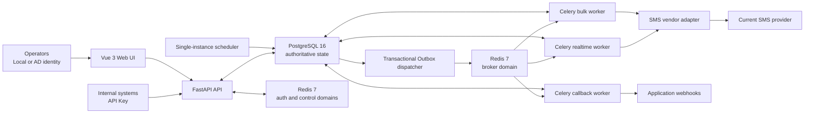

# Enterprise SMS Management Platform

**`Self-hosted`** · **`Security-First`** · **`Built with OpenAI Codex`** · **`v1.6.0`**

A self-hosted enterprise SMS governance platform for API-based and operator-initiated messaging. It centralizes credentials, policy enforcement, approvals, quotas, delivery processing, audit evidence, and operational controls between internal systems and an SMS provider.

> **AI-native development showcase — This entire system was developed 100% from the ground up with OpenAI Codex. It demonstrates how a senior data-center information-security administrator and cybersecurity architect, without a traditional software-development background, can use Codex to build a complex, security-sensitive system with production-grade engineering controls.**

The repository is a reference implementation and an engineering case study. Its source, tests, and deployment contracts do not by themselves certify any specific installation for production use; each operator remains responsible for infrastructure hardening, external TLS, secret custody, network policy, backup validation, and acceptance testing.

## AI-Native Showcase

This project treats AI-assisted development as a controlled engineering process rather than unrestricted code generation. Codex was used throughout requirements analysis, architecture, implementation, testing, security review, documentation, and release automation. The maintainer supplied the operational threat model, compliance constraints, failure semantics, and final approval for every security-sensitive decision.

The working model is deliberately evidence-driven:

- Requirements, API contracts, database schema, vendor protocol details, and security invariants are versioned alongside the code.
- Changes are isolated in short-lived Git worktrees and evaluated with targeted tests, static analysis, contract checks, and risk-based CI gates.
- High-risk behavior—especially irreversible message delivery, credential handling, authorization, and personal-data processing—is designed to fail closed when state cannot be verified.
- AI output is treated as untrusted until it is reviewed against repository policy and supported by repeatable evidence.

The result is intended to be a practical example of how infrastructure and security professionals can translate domain expertise into maintainable software with Codex while retaining human accountability.

## Enterprise Security Features

| Control area | Implemented approach |
| --- | --- |
| Personal-data protection | Phone numbers are persisted as an AES-256-GCM ciphertext, an HMAC-SHA256 lookup value, a masked display value, and a key version. Plaintext phone numbers are prohibited in databases, files, queues, caches, logs, metrics, and audit payloads. |
| Sensitive-content handling | OTP values are masked at persistence and presentation boundaries. Vendor report and reply payloads with consume-on-read semantics are encrypted before parsing so failed processing remains replayable without plaintext storage. |
| Secret containment | Runtime credentials are file-backed secrets by default. API, workers, migration jobs, database roles, and Redis broker/auth/control domains receive only the credentials required for their responsibilities. |
| Injection and untrusted-input defenses | FastAPI/Pydantic request validation, SQLAlchemy-bound persistence, constrained template rendering, upload limits, sensitive-word controls, and spreadsheet-formula neutralization reduce injection exposure. Callback, LDAP, and vendor egress paths apply explicit target policy, redirect restrictions, response limits, and DNS/private-address checks. |
| Reliable, non-duplicating delivery | PostgreSQL is the system of record. Transactional Outbox events, stable idempotency keys, leases, and fencing tokens coordinate asynchronous work. A provider timeout or network failure becomes `uncertain` and is never automatically resent. |
| Authentication and authorization | API clients use scoped API keys; operators use explicit local or AD providers, JWT sessions, server-authoritative account state, role and ownership checks, login throttling, and step-up authentication for high-risk actions. Self-approval is prohibited. |
| Auditability and least privilege | Security-relevant writes and sensitive reads produce correlated audit facts. Runtime database roles cannot update, delete, or truncate the audit log and do not own the schema. Audit records exclude phone numbers, message bodies, tokens, and secrets. |
| Runtime hardening | Long-running containers are non-root, read-only, capability-dropped, resource-bounded, and configured with `no-new-privileges`. Production traffic is expected to enter through an approved external TLS terminator. |
| Supply-chain controls | CI includes Python and frontend tests, coverage gates, Bandit SAST, Trivy vulnerability/misconfiguration/secret/license scanning, contract checks, protected-path review, and independently scanned final images for release candidates. |

These controls reduce risk; they are not a claim of immunity from data leakage, injection, supply-chain compromise, misconfiguration, or implementation defects. See [SECURITY.md](SECURITY.md) for the authoritative threat model, invariants, review scope, and private disclosure process.

## Architecture & Tech Stack



| Layer | Technology and responsibility |
| --- | --- |
| Backend | Python 3.12, FastAPI, Pydantic, SQLAlchemy 2.x async, asyncpg, Alembic |
| Asynchronous processing | Celery 5, Redis broker, PostgreSQL Transactional Outbox, dedicated realtime/bulk/callback workers, single-instance scheduler |
| Data | PostgreSQL 16 as the authoritative state and usage ledger; Redis 7 for isolated broker, authentication, and reconstructable control projections |
| Frontend | Vue 3, Vite, TypeScript, Pinia, Element Plus, ECharts |
| Identity | Local credentials with Argon2, configurable AD/LDAP via ldap3, scoped API keys, JWT session controls |
| Cryptography | AES-GCM authenticated encryption, HMAC-SHA256 indexes and signatures, versioned key handling |
| Deployment | Docker Compose, Nginx, non-root containers, file-backed secrets, cold-standby runbooks |
| Verification | pytest, pytest-asyncio, Hypothesis, coverage gates, Vitest, mypy, Pyright, Ruff, Bandit, Trivy |

The current release integrates one SMS provider behind a single adapter boundary. Multi-vendor routing is intentionally a roadmap item rather than a current capability.

## Roadmap

The roadmap distinguishes existing foundations from the next engineering milestone:

| Milestone | Current baseline | Planned outcome |
| --- | --- | --- |
| **Asynchronous message queues integration.** | Baseline implemented with PostgreSQL Outbox, Redis broker, Celery workers, queue isolation, retries, leases, and fencing. | Continue failure-recovery validation, back-pressure controls, observability, and high-availability deployment guidance. |
| **Multi-vendor failover routing.** | A single-provider adapter boundary exists; automatic cross-provider routing is not implemented. | Add policy-driven provider selection, health-aware failover, provider-specific circuit breakers, idempotency-safe reconciliation, and auditable operator controls. |
| **Automated vulnerability reviews & comprehensive unit testing.** | CI already runs risk-based tests, coverage checks, SAST, dependency, secret, license, and configuration scans. | Expand recurring vulnerability review, adversarial test coverage, property/concurrency/fault-injection suites, and regression evidence for security-critical paths. |
| **Infrastructure-as-code (IaC) deployment documentation.** | Docker Compose contracts, controlled update tooling, backup/restore guidance, and cold-standby runbooks are available. | Document reproducible host provisioning, secret bootstrap, network policy, external TLS, monitoring, backup verification, and disaster-recovery workflows as auditable IaC. |

Roadmap items describe intent, not release commitments. Security invariants and compatibility requirements take precedence over delivery dates.

## Open Source Philosophy

The project's long-term commitment is to remain permanently free and open source. Its purpose is to give traditional IT infrastructure, data-center operations, and cybersecurity professionals a concrete reference model for adopting AI-assisted coding without abandoning operational discipline, security review, or human accountability.

Contributions should improve reusable engineering knowledge as well as code: clear requirements, explicit trust boundaries, tests for failure behavior, reproducible deployment evidence, and documentation that an operator can audit.

> **Licensing status:** the repository is publicly viewable, but the current [LICENSE](LICENSE) retains all rights and is not an open-source license. Until the copyright holder adopts an OSI-approved license, that file remains the controlling legal document and this README does not grant additional rights. The licensing transition must be completed before the project is represented externally as legally open source.

## Local Mock Environment

The supported local workflow requires Python 3.12, Node.js 24, Docker Engine, Docker Compose v2, OpenSSL, and `uv`:

```bash
scripts/local_test.sh prepare
scripts/local_test.sh up
scripts/local_test.sh status
```

The script permits only development settings with mock authentication and a mock SMS provider. It generates random local credentials into Git-ignored files with restrictive permissions and does not print them to the terminal. See [docs/LOCAL_TESTING.md](docs/LOCAL_TESTING.md) for the full procedure.

## Verification

Run the change-aware development gate before committing:

```bash
scripts/dev_check.sh --changed
```

The complete G2 verification stack is reserved for protected changes, release candidates, or explicit reproduction of CI failures:

```bash
bash scripts/verify_all.sh
```

Passing repository checks is evidence for a specific source revision; it is not proof that an external deployment is correctly configured or production-ready.

## Documentation

- [PRD.md](PRD.md) — product requirements and current scope
- [openapi.yaml](openapi.yaml) — HTTP API contract
- [schema.sql](schema.sql) — canonical database schema
- [docs/vendor-api.md](docs/vendor-api.md) — provider protocol and mock contract
- [docs/TRACEABILITY.md](docs/TRACEABILITY.md) — requirement-to-implementation traceability
- [docs/ACCEPTANCE.md](docs/ACCEPTANCE.md) — executable acceptance matrix
- [MAINTENANCE.md](MAINTENANCE.md) — development, CI, test deployment, and release workflow
- [CONTRIBUTING.md](CONTRIBUTING.md) — contribution requirements
- [SECURITY.md](SECURITY.md) — security policy and private vulnerability reporting

## Responsible Disclosure

Do not report unpatched vulnerabilities in a public Issue. Use GitHub's private **Report a vulnerability** workflow and follow [SECURITY.md](SECURITY.md). Never include real phone numbers, credentials, customer data, internal addresses, or production evidence in a report.
