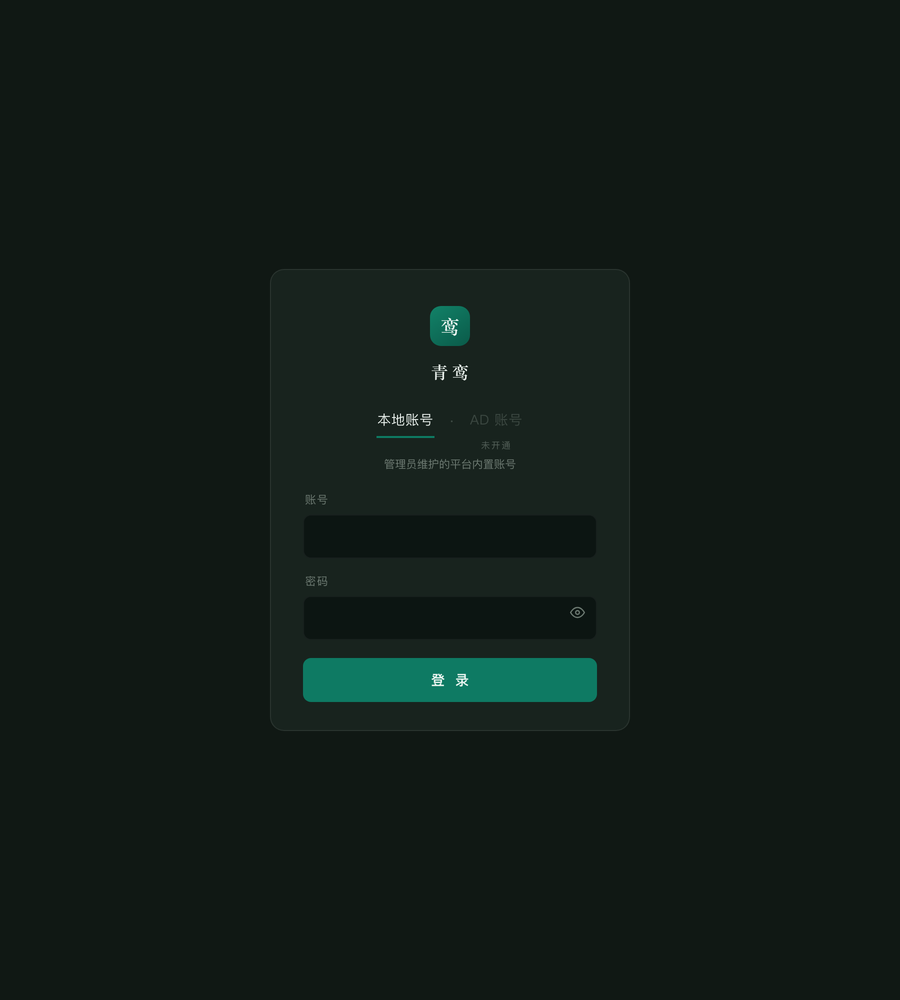
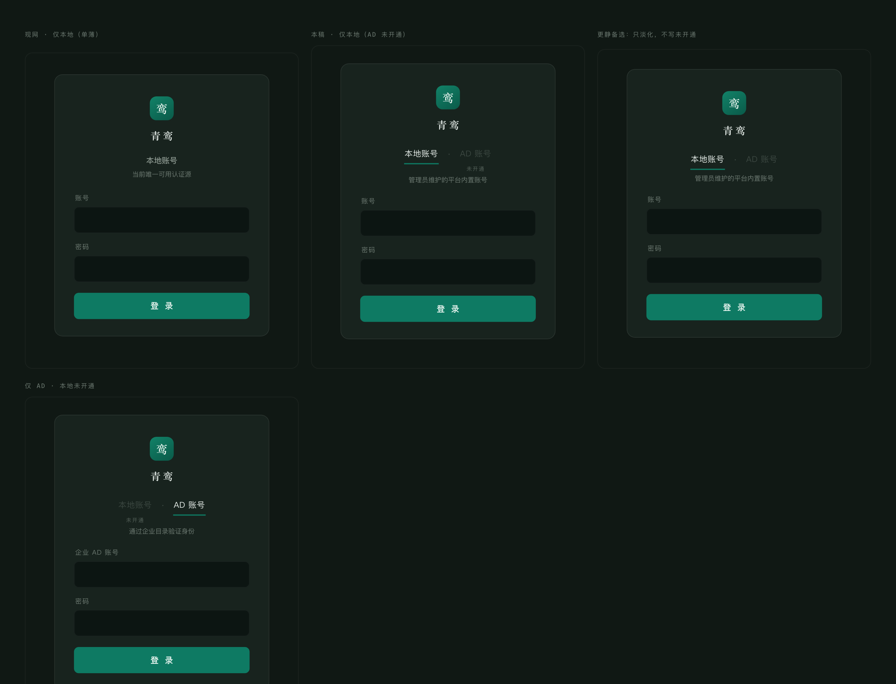
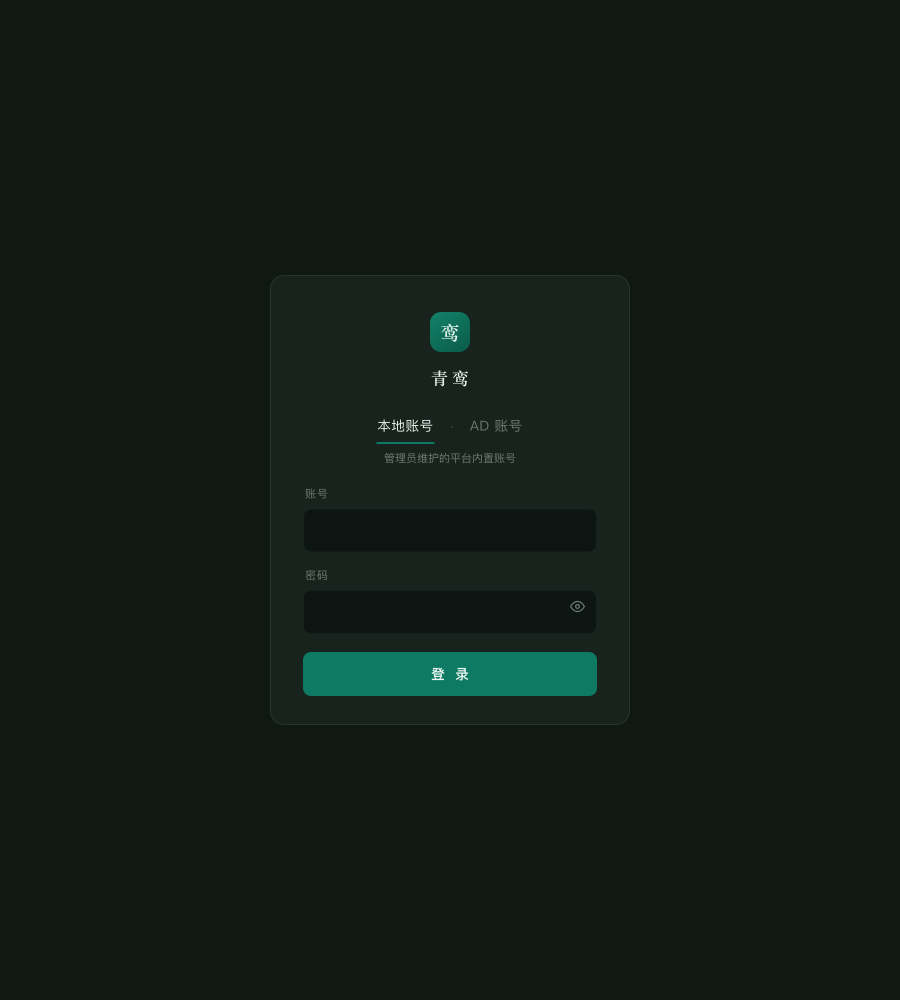
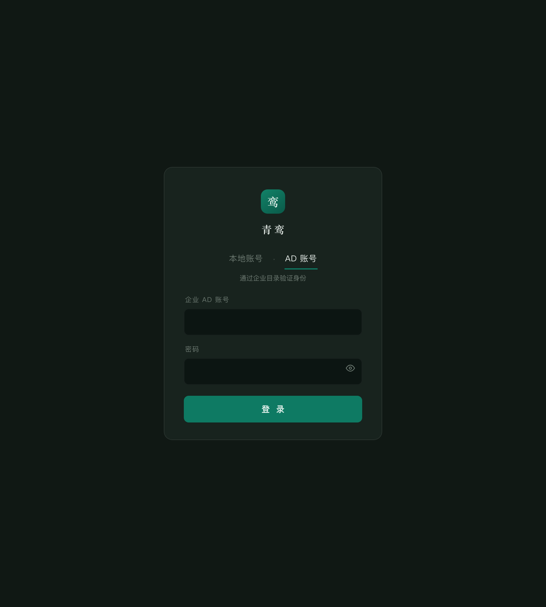
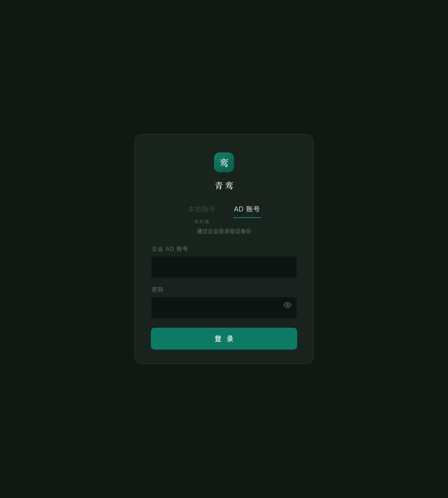
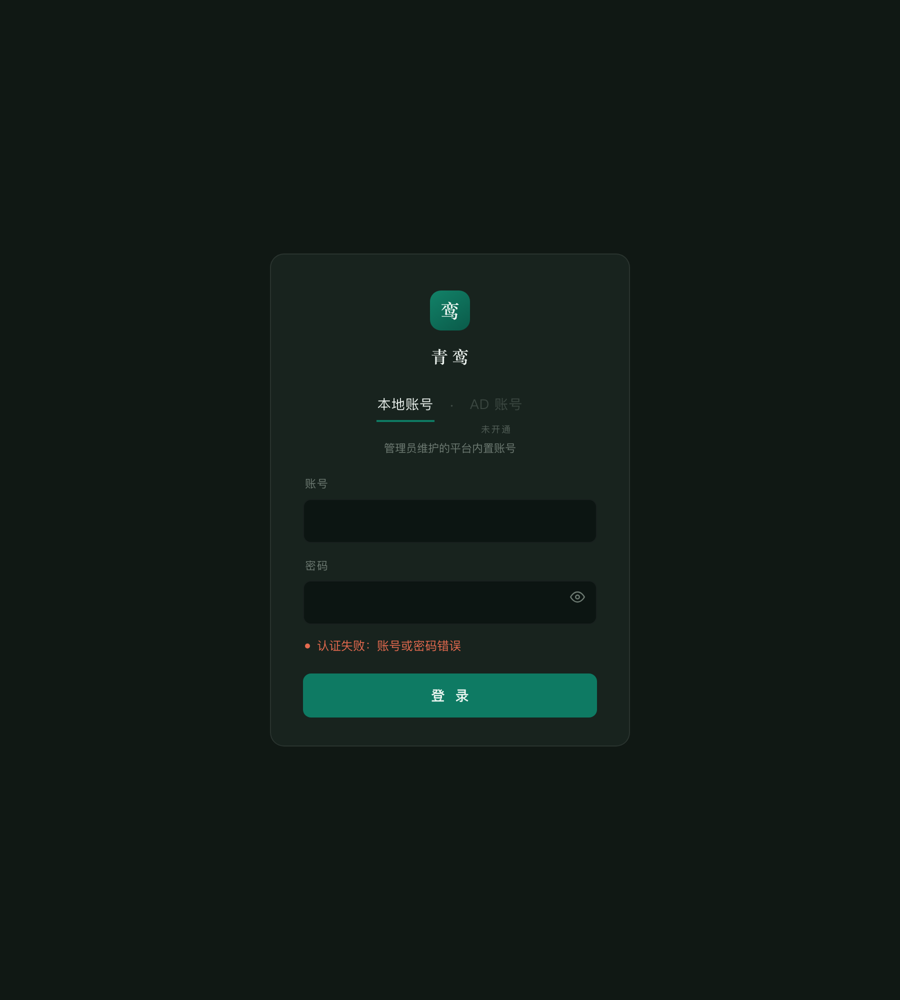

# 认证源始终双显原型截图

静态图，方便 remote 端直接预览。交互稿是 [login-always-two.html](login-always-two.html)。

这一稿不改产品代码。两种认证源始终出现；未开通的那个看得见，但不能选。

## 主推 · 仅本地（AD 未开通）

## 对照：现网单薄 vs 本稿双显

## 双认证源都开通

## 双认证源 · 选中 AD

## 仅 AD（本地未开通）

## 错误态

