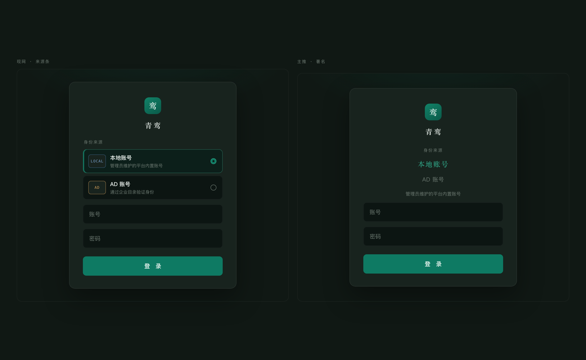
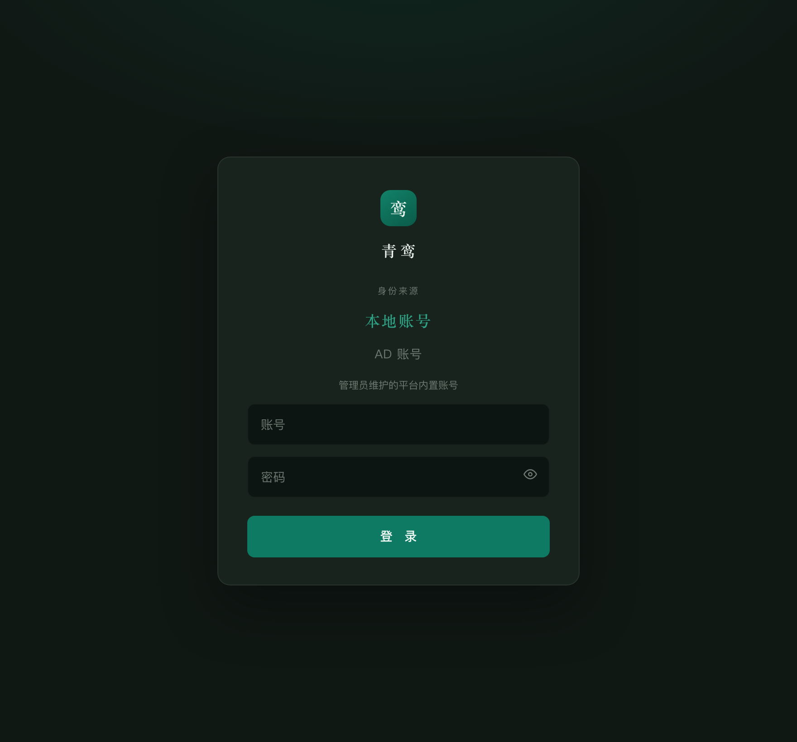
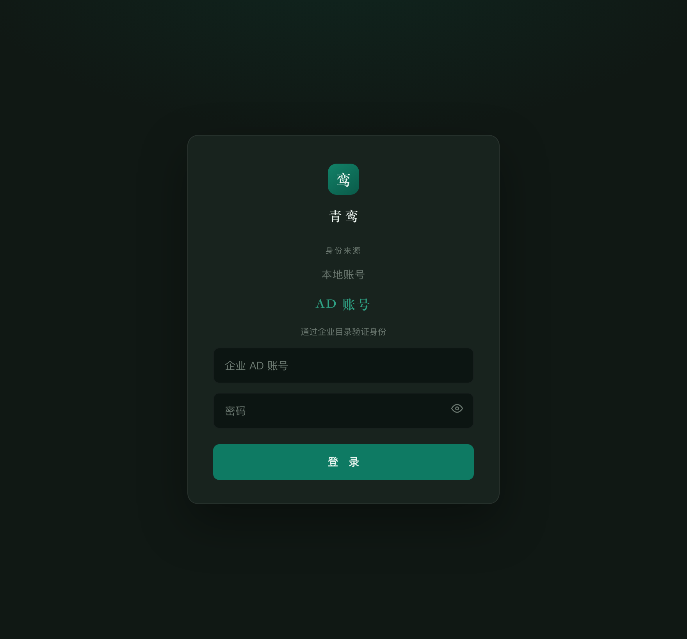
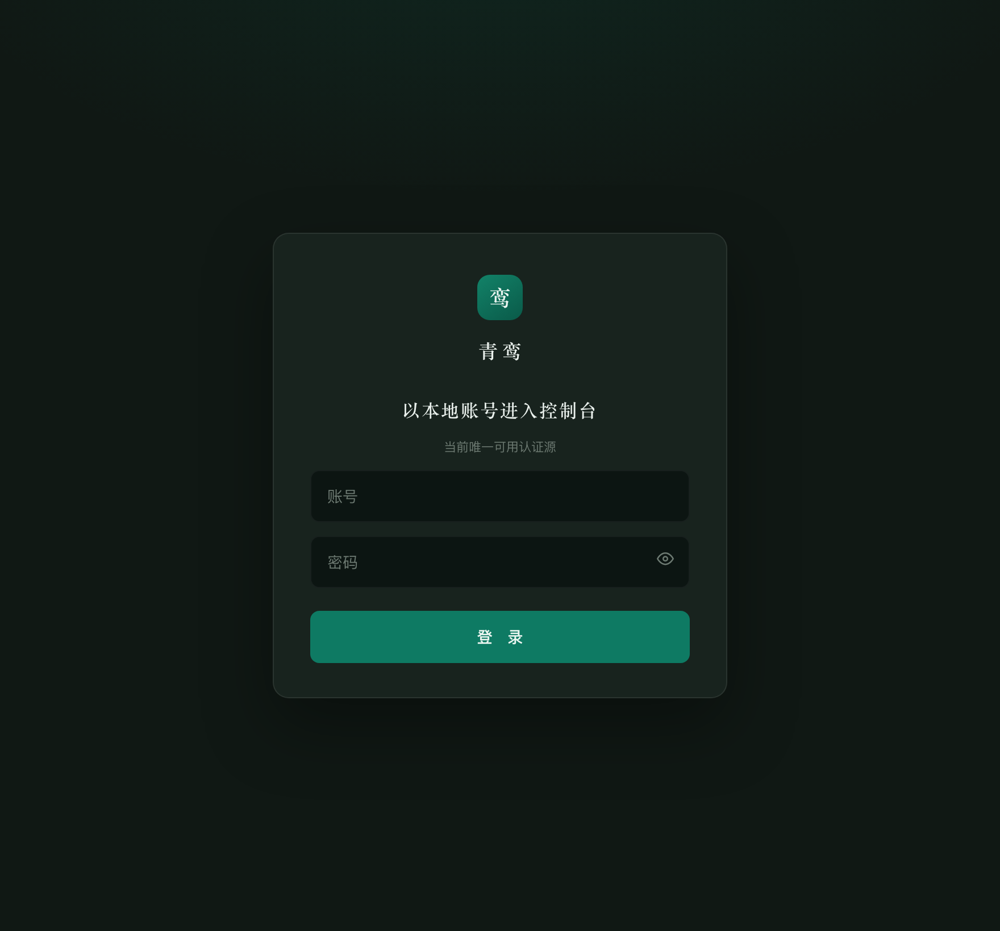
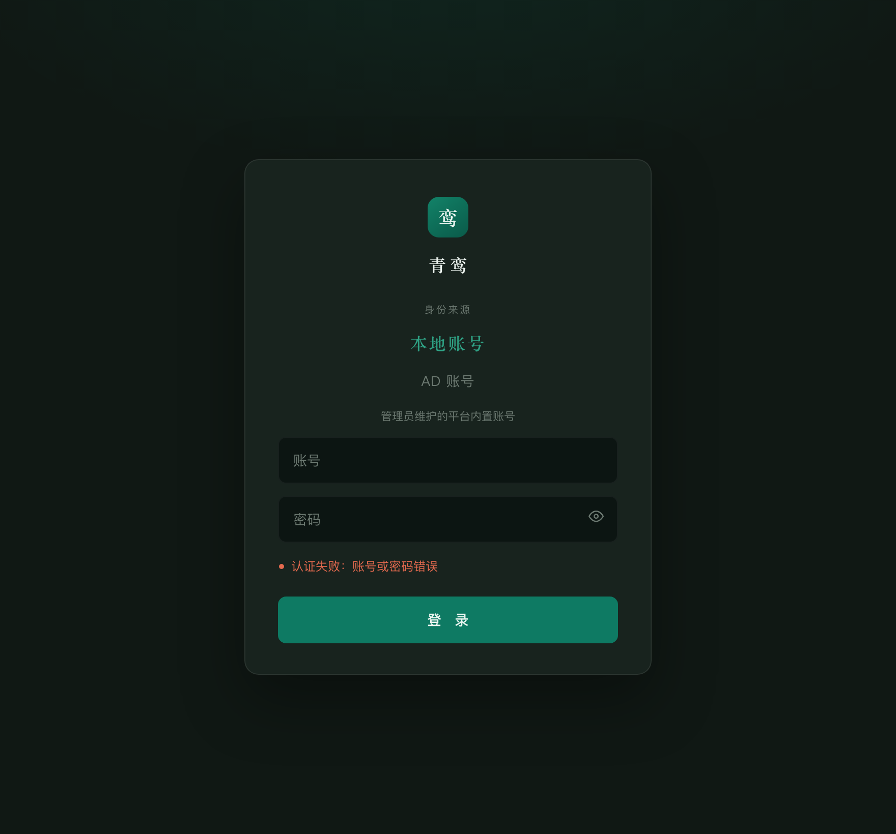
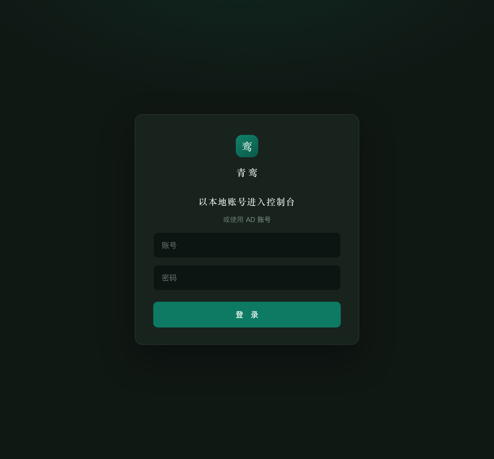

# 登录页署名式原型截图

静态图，方便 remote 端直接预览。交互稿是 [login-identity-signature.html](login-identity-signature.html)。

这一稿不改产品代码。现网仍是身份来源条；这里只讨论要不要换成署名。

## 现网来源条 vs 主推署名

## 主推 · 本地账号（默认）

## 主推 · AD 账号

## 仅本地（收成一句）

## 错误态

## 更静：一句署名

