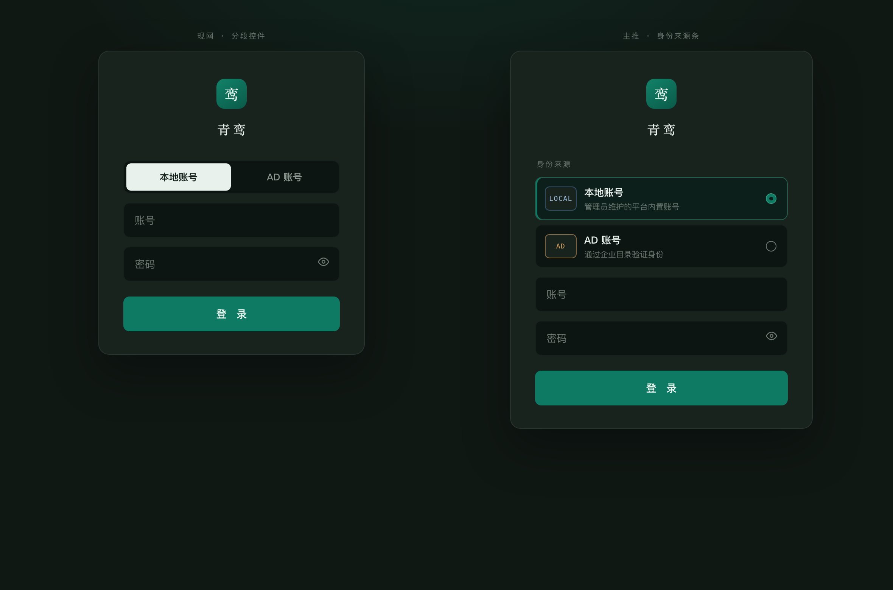
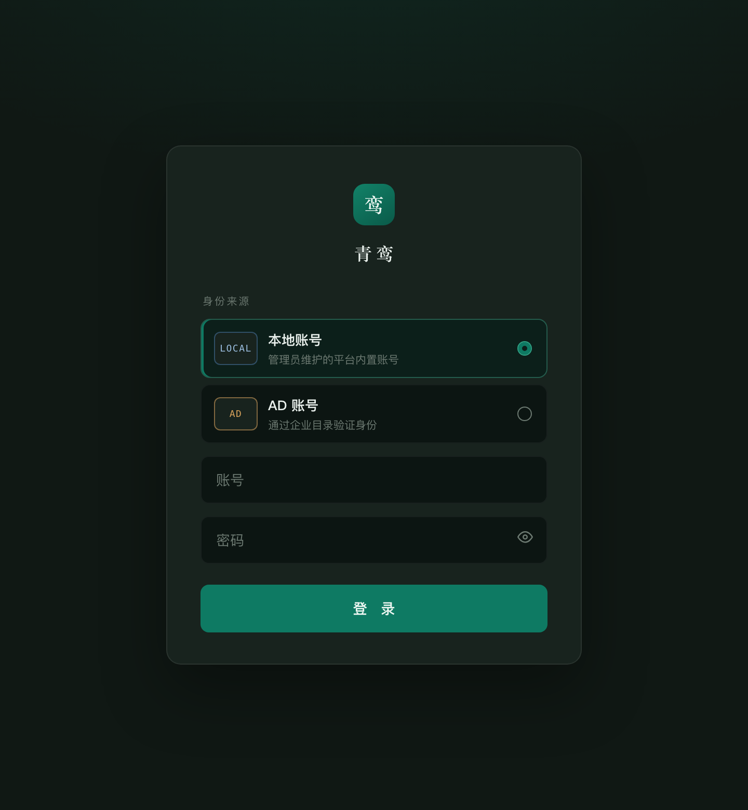
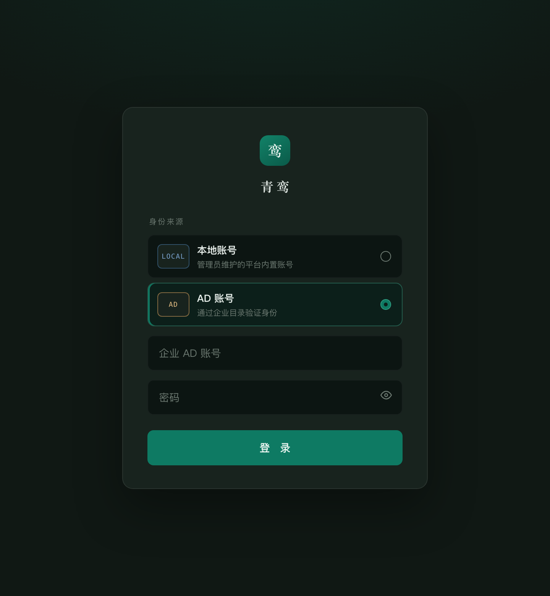
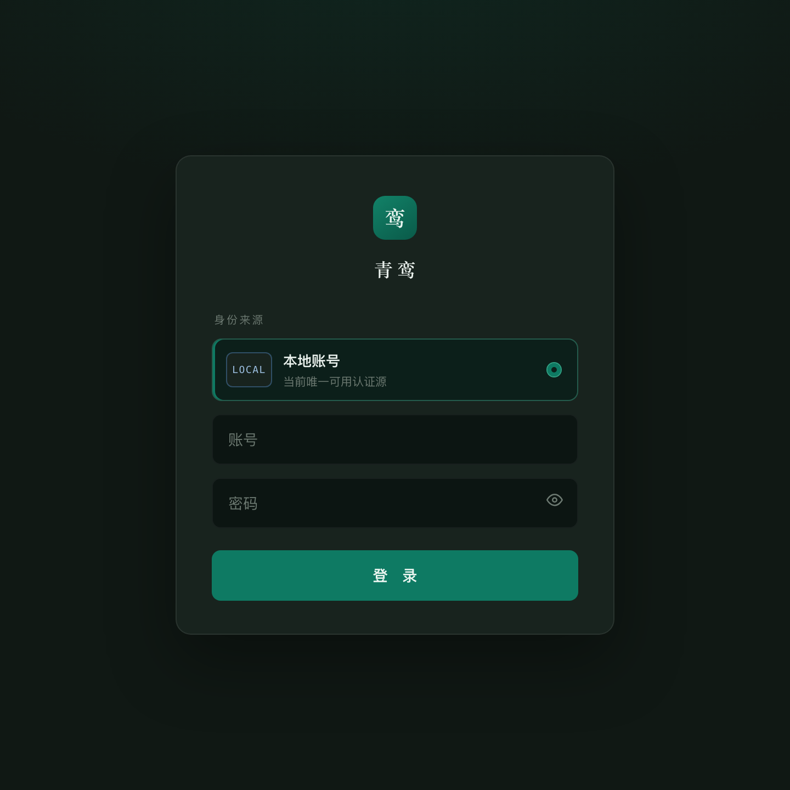
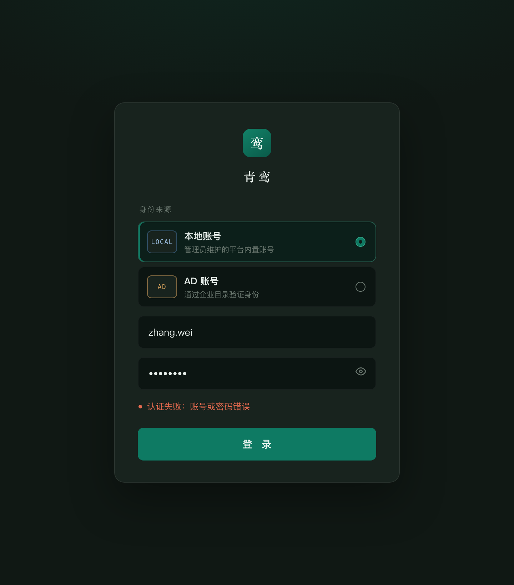
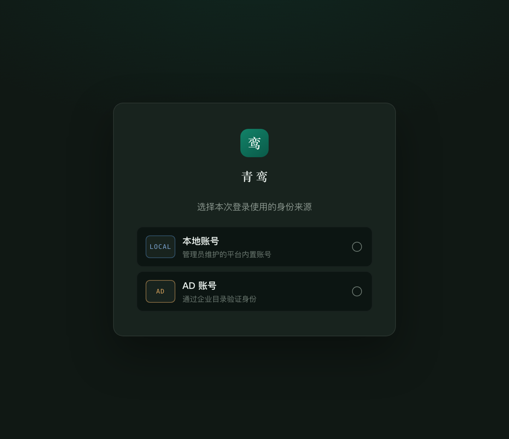

# 登录页原型截图

静态图，方便 remote 端直接在 Cursor 里打开预览。交互稿仍是 [login-redesign-prototype.html](login-redesign-prototype.html)。

## 现网分段 vs 主推来源条

## 主推 · 本地账号（默认）

## 主推 · AD 账号

## 仅本地（AD 未启用）

## 错误态

## 备选：先选来源

