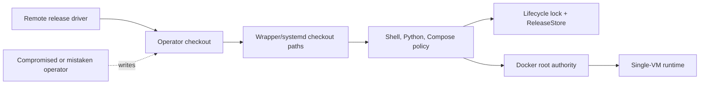
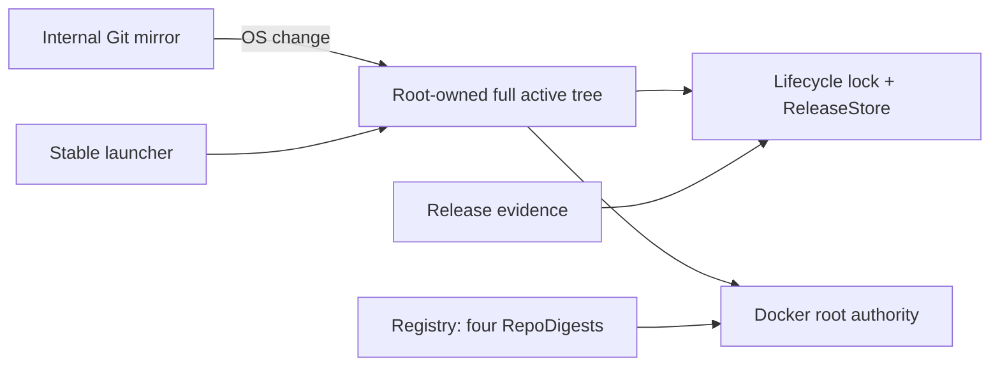
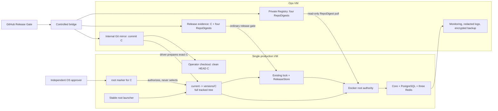
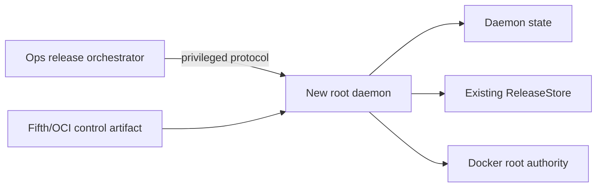

# Security Hardening Proposal: Production Control And Artifact Binding

## Decision

This proposal asks where production root authority should obtain executable repository
bytes, how an exact commit becomes root-authorized when the operator can write the local
checkout and `.git`, and how that host snapshot stays aligned with four immutable image
RepoDigests without changing the signed release manifest or the existing recovery state
machine.

The selected Phase 0 boundary is intentionally small. Internal Git supplies exact source
objects, a root-owned approval marker authorizes one commit, `current` selects one
complete root-owned snapshot of that commit, and the Registry plus release-evidence store
supplies the four runtime artifacts. This task only designs and documents that boundary;
it did not access or change production or pre-production.

## Executive Recommendation

We considered the complete option set before selecting one:

- **Option 1 — Root-owned full release tree:** replace the operator-owned active tree with
  one OS-managed full tree. It gives the simplest single-root trust model, but makes Git,
  persistent data, and application release more tightly coupled to OS changes.
- **Option 2 — Commit-keyed full tracked-tree snapshot:** retain the operator checkout for
  exact Git evidence and ordinary fetch, while every privileged repository byte comes
  from `versions/<40hex commit>`. A root-owned approval marker authorizes the commit and a
  relative `current` symlink is the only active host-control fact.
- **Option 3 — Privileged release agent and separate control artifact:** introduce a
  networked root daemon, orchestrator, and fifth/OCI control artifact. This can make sense
  for a fleet, but it conflicts with the approved KISS boundary for one host.

I recommend **Option 2** under the approved V1 constraints. Unlike a selective control
closure, it copies every regular Git-tracked file and records commit, tree, path, Git mode,
size, and SHA-256. The fixed revision contains 1,000 tracked files and 16.93 MiB, so the
complete-tree cost is proportionate and removes the hidden-import/Compose/script omission
problem that gave the smaller closure design pause.

The important operational cost is explicit: in Phase 0, every commit approved for a
production Registry release needs a lightweight OS authorization marker before the
driver may activate its snapshot. The release driver may orchestrate snapshot
prepare/activate/status, but that does not turn the action into an ordinary application
change. The marker must already have been created by an independently approved OS change;
the normal wrapper has no approve operation.

## Evidence

I inspected the fixed revision identified in [the analysis context](../context.md). The
worktree also contained an in-progress P0-A implementation, which I used only to align
this handoff with the selected commit-keyed interface. I do not treat working-tree files
as completed, tested, or deployed evidence.

| Evidence | Finding or document | What it establishes |
| --- | --- | --- |
| `E001` | [`deploy/sms-compose`](../../../../deploy/sms-compose) and production systemd units | The current production wrapper derives executable Python, Compose, and policy paths from the checkout; host installation makes the public wrapper a symlink into that tree. |
| `E002` | [`scripts/deploy_release_remote.py`](../../../../scripts/deploy_release_remote.py) | The remote driver fetches and fast-forwards the operator checkout, then invokes privileged release prepare, activate, and status. |
| `E003` | [`deploy/scripts/release_manager.py`](../../../../deploy/scripts/release_manager.py) and [`release_store.py`](../../../../deploy/scripts/release_store.py) | Exact commit/image/migration identities, terminal `recovery_required`, compensation, and forward-only schema behavior already have one lifecycle authority. |
| `E004` | [`docs/DECISIONS.md`](../../../../docs/DECISIONS.md) | RepoDigest promotion is the intended runtime identity; the signed offline archive is temporary compatibility infrastructure with a Registry exit condition. |
| `E005` | [`docs/threat-model.md`](../../../../docs/threat-model.md) | Core, PostgreSQL, and three isolated Redis processes remain on one accepted non-HA production VM. |
| `E006` | [Approved V1 target](../context.md#approved-target-architecture-record) | Internal Git, private Registry, and release evidence remain; the same exact commit identifies the operator source and root-owned snapshot, while four RepoDigests identify runtime images. |
| `E007` | [Approved KISS and root-authorization constraints](../context.md#approved-target-architecture-record) | Each candidate commit needs a root-owned OS approval marker; no selective closure, control digest, manifest field, fifth image, OCI control artifact, daemon, signing change, Kubernetes/HA, or offline expansion is allowed. |

### Observed

At the fixed revision, root/Docker operations can reach checkout-owned shell, Python,
Compose, and systemd paths (`E001`). The driver mutates that operator-owned checkout before
invoking the release lifecycle (`E002`). The release lifecycle itself already has exact
identities and explicit recovery boundaries (`E003`), so replacing it would add risk
without addressing the ownership inversion.

The approved supply-chain direction retains both internal Git and Registry/evidence
channels (`E004`, `E006`). The single production VM remains an accepted common failure
domain rather than an HA design (`E005`).

### Inferred

The structural weakness is broader than one wrapper symlink. If root imports or executes
any path whose directory entries or `.git` objects are controlled by the operator, an
operator credential compromise or mistaken update can influence Docker/root behavior.
Simply naming a 40-hex commit is insufficient authorization because that operator can
write refs and objects in local `.git`; an independently controlled root allow decision is
needed before a commit can become active.

The converse inference is also important: we do not need another release state machine.
A root-owned authorization marker answers “may this commit be adopted?”, while the
relative `current` symlink answers “which complete snapshot is active?”. Those are
different questions. `current` can remain the sole active fact, and ReleaseStore can
remain the sole application recovery authority.

### Proposed

The proposed joint identity is deliberately simple:

```text
internal Git exact commit C
+ root-owned approval marker production-control-approved/C
+ current -> versions/C
+ snapshot manifest(commit=C, tree=T, every path/mode/size/sha256)
+ release evidence(commit=C, four image RepoDigests)
+ runtime readback of the same four RepoDigests
```

There is no separately calculated control-set digest and no new release-manifest field.
The snapshot is bound to the release because its directory, manifest, clean operator HEAD,
and host-control status all identify the same exact commit `C`.

## Current Design And Failure Mode

The current call chain crosses an ownership boundary in the wrong direction:

1. the operator updates `/opt/sms-platform` and its local Git metadata;
2. `/usr/local/sbin/sms-compose` or a root systemd unit enters paths in that checkout;
3. checkout shell/Python/Compose bytes obtain root or Docker authority;
4. ReleaseStore then carefully validates images and state, but only after root has trusted
   the mutable control plane that interprets those checks.

That condition supports several realistic attack or failure paths:

- replacing the checkout wrapper, a local Python import, Compose file, or bind-executed
  script can change privileged behavior without changing an image RepoDigest;
- changing a local Git ref can present a different 40-hex commit unless root independently
  authorizes the exact commit;
- leaving `.env`, canonical secrets, or security-report writable state under the checkout
  lets an application release rename or reinterpret OS-owned data authorities;
- a mixed or partially copied root tree can run if publication is not generation-based and
  durable;
- a Registry tag or evidence mismatch can select runtime bytes that do not correspond to
  the source commit even though containers start successfully.

The first two paths are fixed by root authorization plus immutable snapshots. The third is
fixed by explicit OS paths and metadata contracts. The fourth is fixed by a complete
generation and one atomic relative link. The fifth remains the responsibility of the
existing exact release evidence and RepoDigest checks.

## Desired Invariants

1. Every production root process executes repository bytes only from one root-owned,
   non-group-writable `versions/<40hex commit>` generation.
2. The stable launcher acquires the existing lifecycle lock before resolving `current`,
   validates the complete snapshot, and pins one physical generation for the operation.
3. `/etc/sms-platform/production-control-approved/<commit>` is a root-owned, regular,
   read-only authorization marker containing exactly the 41 ASCII bytes `<commit>\n`.
   Host-control prepare, activate, and status all fail closed when the marker is absent,
   unsafe, or has different content.
4. The approval directory and markers cannot be created, repaired, or removed by the
   normal wrapper, release manager, operator account, or containers.
5. `current` is a relative link exactly matching `versions/<40hex commit>` and remains the
   only active host-control fact. A marker authorizes but never selects a generation.
6. Each snapshot contains the complete regular Git-tracked tree. Its canonical manifest
   records commit, tree, sorted path, Git mode, byte length, and SHA-256 for every file;
   missing, extra, linked, or metadata-drifted entries fail closed.
7. The operator checkout remains useful for internal-Git fetch and exact/clean HEAD
   evidence, but no production root process imports, sources, or executes its bytes.
8. Driver-orchestrated host-control prepare/activate/status completes for the exact commit
   before the existing release prepare/activate/status sequence. The latter keeps its
   signed schema and state fields unchanged.
9. `/etc/sms-platform/platform.env`, `/etc/sms-platform/secrets`, and
   `/var/lib/sms-platform/security-report` are precreated OS authorities with reviewed
   owner/mode changes; application release never creates or relocates them.
10. Production pulls exactly four images by immutable RepoDigest using a read-only
    Registry identity. Mutable tags, local builds, and manual image loads are not release
    authority.
11. `recovery_required`, compensation, and schema forward-only behavior remain unchanged;
    snapshot activation accepts only the current commit or a Git descendant and never
    performs a backward or divergent control transition.
12. The offline reader remains compatibility-only and does not create approval markers,
    advance host control, or become an automatic fallback for Registry failure.

## Constraints And Non-Goals

We retain the approved V1 topology: GitHub Release Gate promotes through a controlled
bridge to an Ops VM carrying the internal Git mirror, private Registry, release evidence,
monitoring, redacted logging, and encrypted backup storage. Production remains one VM for
Core, PostgreSQL, and broker/auth/control Redis.

The design reuses the release driver, lifecycle lock, stable wrapper interface, and
ReleaseStore. We do not add a fifth image, OCI control artifact, new privileged daemon,
new signing schema, control digest, Kubernetes, datastore HA, or expanded offline
package. We also do not treat the root approval marker as a substitute for Git object
identity, CI review, Registry evidence, or two-person change approval.

This proposal does not provision production, the Ops VM, internal Git, Registry,
monitoring, logging, or backup services. It does not claim that root compromise is solved,
that the two VMs are highly available, or that backup/restore objectives are met without
runtime evidence.

## Before Architecture

The [before diagram](../diagrams/production-control-and-artifact-binding-before.mmd) shows
the dangerous edge: an operator-controlled tree supplies bytes to root/Docker authority.



The lock prevents concurrent lifecycle mutations, but it cannot make the code that takes
the lock trustworthy. That ownership edge is the design problem the options must remove.

## Options

### Option 1: Root-Owned Full Release Tree

Option 1 removes the operator-owned active tree entirely. An OS change installs a complete
root-owned repository tree for the exact internal-Git commit, and both privileged control
and ordinary project paths use that one tree. Its strongest case is conceptual economy:
there is no split-root rule to misunderstand and no operator checkout that a root entry
can accidentally re-enter.

The cost is that Git operator activity, persistent configuration, release staging, and
application deployment must all be redesigned around an OS-owned tree. Even a commit that
only changes application source can force a broad OS-tree adoption. If teams respond by
relaxing the exact-commit relationship, the operational burden can undermine the security
benefit.

We could roll it out as a new root-owned tree beside the existing checkout and switch all
units in one reviewed OS window. Before the first active switch, an incomplete staged tree
can be abandoned without changing authority. After activation, control remains on the same
commit or advances to a marker-authorized Git descendant; it never reactivates an older or
divergent tree. Application recovery continues through the existing forward path.

The [Option 1 diagram](../diagrams/production-control-and-artifact-binding-full-root-release-tree-after.mmd)
shows the single-root model:



| Change | Before | After | Security consequence | Cost |
| --- | --- | --- | --- | --- |
| Root code ownership | Operator checkout supplies root bytes | Entire active tree is root-owned | Removes the checkout write-to-root edge | Large ownership and operating-model migration |
| Path model | One operator tree mixes code and data | One OS-owned full tree | Few split-root mistakes | Git, staging, config, and persistence need redesign |
| Release coupling | Git fast-forward precedes release | Exact full tree is an OS adoption | Exact identity is simple | Every app commit can become a broad OS change |
| Recovery | Git stays forward during app compensation | Old full trees retained only for evidence | Staged tree can be abandoned before first switch | After activation, repair is descendant-only |

Option 1 becomes preferable if the project decides to eliminate the operator checkout
from production entirely or repeatedly fails to enforce the split between immutable
control and fixed OS data roots. Under the current Phase 0 workflow, that migration is
larger than necessary.

### Option 2: Commit-Keyed Full Tracked-Tree Snapshot

Option 2 retains `/opt/sms-platform` for operator Git evidence but removes it from the
privileged execution boundary. The root snapshot manager reads one exact commit through a
fixed, sanitized Git invocation, inventories every regular tracked file, and builds
`versions/<commit>`. Files are normalized to root-owned read-only modes while the manifest
preserves their Git modes and records byte size and SHA-256. The snapshot manifest also
records the exact commit and Git tree identity.

This is intentionally not a selective control closure. A Python import, Compose include,
or newly added root script cannot be omitted merely because an allowlist was stale: if it
is a regular tracked file, it is in the snapshot. At the fixed revision the copy is 1,000
files and 16.93 MiB. We still keep hard file-count, per-file, path-length, and total-byte
limits so a malicious or mistaken candidate cannot turn an OS adoption into an unbounded
copy.

Because the operator can write local `.git`, commit identity needs a separate authority.
An independently approved OS change creates a regular marker at
`/etc/sms-platform/production-control-approved/<commit>`. The recommended metadata is a
root:root `0755` approval directory and a root:root `0444`, single-link, 41-byte marker
with an exact lowercase 40-hex filename and exact ASCII content `<commit>\n`. Creation
uses a same-directory temporary inode, no
replacement of an existing mismatched target, and a parent-directory fsync. The snapshot
manager and normal wrapper have no approve subcommand.

The marker is not state about what is running. Host-control `prepare` verifies the marker
and builds/reuses the complete snapshot without changing `current`. After the operator
checkout has fast-forwarded to the exact clean commit, host-control `activate` revalidates
the marker, Git identity, snapshot manifest, and lifecycle lock, then atomically replaces
`current` with a temporary relative symlink. Host-control `status` resolves the active
commit and revalidates its marker and complete snapshot. Before the rename, the old
complete snapshot is active; after it, the new complete snapshot is active.

If `current` already exists, activation also proves that its commit is an ancestor of the
candidate through the fixed Git read boundary. Same-commit activation is idempotent;
backward and divergent activation fail closed even if both commits have valid root
markers. This ancestry rule is the host-control equivalent of the existing schema
forward-only contract.

The [Option 2 diagram](../diagrams/production-control-and-artifact-binding-versioned-control-snapshot-after.mmd)
shows why the three authorities are complementary:



Internal Git supplies bytes and source identity; it does not grant root authorization.
The marker grants authorization; it does not identify runtime images or select active
state. Registry/evidence supplies the four immutable runtime artifacts; it does not supply
root host code. Requiring all three avoids making any single channel do a job it cannot
prove.

The stable launcher is a fixed root-owned regular file. It sanitizes shell/Python
startup influence, takes the existing lifecycle lock, resolves the exact relative
`current` target, verifies and pins the physical snapshot, and enters its wrapper. A
queued operation cannot resolve an old generation before waiting on the lock and then run
after a switch.

The wrapper's `__locked` action is not an operator API. It is a private continuation used
only after the lock helper has acquired and verified the exact lifecycle-lock inode and
passed its held file descriptor. It must not appear in the public usage contract or a
sudoers allowlist. Direct invocation, a forged marker, an unlocked descriptor, or a
descriptor for another inode must return before Docker, Git mutation, or filesystem side
effects.

The release driver coordinates the following sequence for a production Registry release:

- verify the approved Git ref, release evidence, and four RepoDigests;
- fetch the exact candidate commit into the operator repository;
- invoke host-control `prepare` for that exact commit; absence of the root marker blocks;
- fast-forward the clean operator checkout to the same commit;
- invoke host-control `activate` and `status`, still under the independent OS approval;
- invoke the existing release `prepare`, `activate`, and `status` unchanged.

This ordering does not add a control digest or write new fields into the signed package or
ReleaseStore. The ordinary lifecycle continues to bind exact commit, release evidence,
four images, migrations, and state transitions. Host-control adoption is an explicit OS
sub-change even though one driver produces the deterministic command plan. In Phase 0,
every newly approved release commit therefore incurs this lightweight OS approval cost.

First bootstrap uses the same durability idea without an installer state machine. The
root-owned bootstrap command verifies and installs the snapshot manager, validates the
approval marker, prepares the initial complete snapshot, creates `current`, verifies
status, and atomically replaces the stable launcher last. An interruption before that
last replacement leaves the legacy launcher authoritative; an idempotent retry verifies
and reuses completed prerequisites. No active-state file, intent, or bootstrap journal is
created.

The immutable snapshot must not absorb mutable host data. These paths are precreated by
the independent OS change, and the plan/apply output must show current metadata and target
metadata without showing file contents:

| Fixed OS path | Target owner:group | Target mode | Change-preview rule |
| --- | --- | --- | --- |
| `/etc/sms-platform` | `root:root` | `0755` (never group/other writable) | Reject symlink or unsafe ancestor; preview only metadata delta |
| `/etc/sms-platform/platform.env` | `root:root` | `0600` | Precreate as regular single-link file; never copy from checkout |
| `/etc/sms-platform/secrets` | `root:root` | `0700` | Precreate exact canonical inventory; children are root:root regular `0600` files |
| `/etc/sms-platform/production-control-approved` | `root:root` | `0755` | Only the OS approval command may add exact `0444`, 41-byte `<commit>\n` markers |
| `/var/lib/sms-platform/security-report` | `root:root` | `0755` | Precreate outside Git; no application-release `mkdir` or relocation |
| `.../control` | `root:root` | `0755` | Fixed parent for collector/mailbox separation |
| `.../control/incoming` | `root:10001` | `0750` | Collector writes root-created snapshots for the runtime reader |
| `.../control/incoming/<date>.json` | `root:10001` | regular single-link `0640` | Runtime uid gets group read only; collector atomically replaces one legacy `10001:10001` inode |
| `.../control/requests`, `.../control/results`, `.../config` | `10001:10001` | `0700` | Runtime-owned queues/config; preview each path separately |
| `.../nginx` | `101:101` | `0750` | Nginx-owned log surface; collector receives read-only access |

Numeric runtime IDs must be verified against the frozen host account contract before the
OS order is approved. A mismatch blocks; the adoption command must not guess or recursively
chown an unknown tree.

#### OS-layer baseline around the snapshot

The snapshot removes one code-ownership edge but does not replace ordinary host security.
The OS change and acceptance evidence should also require:

- key-based, bridge-constrained operator SSH; direct root login and password
  authentication disabled; sudo limited to reviewed fixed argv rather than a shell;
- no operator membership in the Docker group and no Docker socket mounted into
  application containers;
- root-owned, non-group/other-writable ancestors for launcher, snapshot, approval, env,
  secret, systemd, and report paths;
- production systemd sandboxing with the minimum capabilities, read-only system surfaces,
  and explicit `ReadWritePaths` only for fixed data roots;
- a host firewall allowing only approved application ingress and required Git, Registry,
  evidence, monitoring, backup, vendor, and administration flows, with TLS hostname/CA
  verification where the protocol supports it;
- change-controlled kernel, OpenSSH, Docker/Compose, and base-OS patching plus reboot/readback
  evidence; a repository snapshot is not an OS patch mechanism;
- synchronized time for TLS, evidence, audit, and recovery ordering;
- existing journald/log forwarding or host audit facilities monitoring metadata drift in
  launcher, `current`, markers, units, env, and secret roots without logging secret
  contents or private command output;
- encrypted off-host backups and a restore drill; full-disk/VM encryption and boot-chain
  controls are recorded as verified, unavailable, or residual rather than assumed.

These checks reuse the OS and monitoring facilities chosen for V1. They do not require a
new release daemon. The operator account remains able to update its checkout, but that
checkout is no longer the active root execution tree.

#### Registry and evidence supply-chain baseline

The Registry path is also more than “pull by digest.” GitHub Release Gate produces the
four final images and independent scan/SBOM evidence; the controlled bridge promotes them
to immutable Registry namespaces and records the destination RepoDigests after promotion.
Production has separate read-only Git, Registry, and evidence identities and cannot push,
retag, delete, or weaken retention.

Registry and evidence access must verify TLS CA and hostname, reject mutable-tag authority,
read back all four destination RepoDigests and image commit labels/IDs, preserve evidence
append-only retention, and fail closed when Git commit, evidence, digest, label, or runtime
image ID disagrees. Registry vulnerability-database freshness and the four independent
image gates remain review evidence; they are not replaced by snapshot validation. None of
this creates a fifth artifact or changes the signed schema.

| Change | Before | After | Security consequence | Cost |
| --- | --- | --- | --- | --- |
| Root entry | Symlink/direct checkout paths | Stable launcher enters one pinned snapshot | Removes mutable checkout code from root | Launcher and manager become a small root TCB |
| Snapshot scope | Root implicitly sees whatever checkout path resolves | Every regular tracked file is copied and attested | Avoids selective-closure omissions | Larger root-owned TCB and bounded disk copy |
| Root authorization | Local Git commit/ref is sufficient input | Exact commit also needs a root-owned marker | Operator `.git` cannot authorize arbitrary root code | One light OS approval per Phase 0 release commit |
| Active fact | Checkout HEAD implies control | `current -> versions/<commit>` alone selects active control | Atomic, auditable before/after states | Old versions need explicit retention policy |
| App release | Git fast-forward then release lifecycle | Host snapshot adoption, then unchanged release lifecycle | Same commit binds host code and runtime images | Driver sequencing and OS/app approval separation |
| Mutable host data | Checkout `.env`, secrets, report directories | Fixed precreated OS paths | Operator release cannot rename authority | One-time metadata migration and ongoing drift checks |
| Supply chain | Temporary offline package | Internal Git plus Registry/evidence | Independent source and runtime readback | Ops VM becomes release-availability dependency |

There is no application request-path hop and no resident process. The material resource
cost is OS-change-time hashing/copying plus retained generation disk. Reliability improves
because publication has two complete outcomes, but the split-root rule and approval-marker
metadata become important operational checks. We should measure plan/prepare/activate and
status against a pre-production baseline rather than inventing a latency threshold.

Snapshot recovery is forward-only. Once `current` exists, every backward or divergent
selection attempt is rejected for both ordinary release and OS actions, including before
the dependent application release is PREPARED. Same-commit retry is idempotent;
remediation uses a newly reviewed, marker-authorized descendant commit. Application image
compensation, `recovery_required`, and forward rollback continue under the existing
ReleaseStore.

### Option 3: Privileged Release Agent And Separate Control Artifact

Option 3 moves release authority behind a production root daemon and an Ops-side
orchestrator. A separately promoted control artifact could carry host code and a protocol
could authorize activation. The attractive part is fleet coordination: for many hosts,
central queuing, authorization, and rollout observation may justify a dedicated service.

For this single VM, the option creates more boundaries than it removes. We would need a
network-reachable root parser, service credentials, replay rules, certificate rotation,
daemon upgrade compatibility, dual daemon/ReleaseStore recovery, and a fifth or OCI
artifact plus evidence/signing rules. Those are precisely the components the approved
KISS constraint rejects.

Rollback is also harder: an interrupted daemon upgrade or partition can disagree with
ReleaseStore about which action is authoritative. We would need a separate architecture
and threat-model review before considering it; it should not be smuggled into P0-A.

The [Option 3 diagram](../diagrams/production-control-and-artifact-binding-privileged-release-agent-after.mmd)
shows the additional protocol and state:



| Change | Before | After | Security consequence | Cost |
| --- | --- | --- | --- | --- |
| Privileged entry | Local wrapper | Authenticated network daemon | Can centralize authorization | New remote root attack surface |
| Control delivery | Repository paths | Fifth/OCI artifact | Independently versioned bytes | New artifact and signing/evidence schema |
| Recovery | One ReleaseStore | Daemon state plus ReleaseStore | Fleet orchestration possible | Ambiguous dual-state reconciliation |
| Operations | SSH driver and lock | Orchestrator, daemon, certificates | Richer coordination | New lifecycle, monitoring, and incident burden |

Option 3 becomes worth revisiting only if production grows into a multi-host fleet whose
measured coordination problem outweighs the new privileged service. That is not the
current requirement.

## Comparison

| Dimension | Option 1: full active tree | Option 2: commit-keyed snapshot | Option 3: privileged agent |
| --- | --- | --- | --- |
| Security | Strong single-root boundary; large OS-owned surface | Strong root boundary; full tree avoids closure omissions; marker blocks arbitrary local Git commits | Can centralize policy; adds networked root parser and credentials |
| Performance | Full-tree work on every OS adoption; no request-path hop | 16.93 MiB baseline tree hash/copy at OS change; no request-path hop | Extra protocol hop on release operations |
| Memory | No resident process; retained full trees use disk | No resident process; transient verification buffers and retained snapshots | Resident daemon, queues, credentials, observability buffers |
| Reliability | Simple active tree but broad migration failure surface | One atomic active link and idempotent complete generations; marker/current roles are distinct | Orchestrator/agent partition and dual-state ambiguity |
| Operability | Replaces familiar operator Git workflow | Keeps driver/Git/release lifecycle; adds one OS marker per commit and fixed-path preview | New daemon, protocol, certificates, upgrade and incident runbooks |
| Migration | Redesign Git, config, staging, persistence, and units | Split immutable control from fixed data paths; reroute root units | New service, artifact, signing, evidence, and network contracts |

Option 1 removes split-root mistakes but asks the largest operating-model change. Option 3
offers capabilities we do not need. Option 2 spends a small amount of disk and one OS
authorization per release commit to preserve the existing application lifecycle while
closing the privilege edge.

## Recommendation

I recommend **Option 2 — Commit-keyed full tracked-tree snapshot** for the approved Phase
0 production design. `E001` and `E002` show why root must stop consuming checkout bytes;
`E003` shows why we should preserve the existing release state machine; `E006` and `E007`
make the internal Git/Registry/evidence channels, root marker, complete snapshot, and KISS
constraints binding.

The complete-tree decision is intentional. At 16.93 MiB, reducing disk by maintaining a
selective closure is not worth the possibility of omitting a future import, Compose file,
or root script. The marker is equally important: without it, the operator's ability to
write `.git` would let a local commit identifier become root authorization.

This recommendation is conditional on accepting one lightweight OS approval per Phase 0
production commit and on enforcing the fixed data/control path split. Option 1 should win
if the organization later removes the operator checkout altogether. Option 3 should be
reconsidered only for a measured multi-host coordination requirement and a separate
architecture review.

## Evidence Coverage And Residual Risk

| Evidence | Option 1 | Option 2 | Option 3 | Tactical protection still required |
| --- | --- | --- | --- | --- |
| `E001` — Checkout-root execution | Addresses by replacing the active tree | Addresses when every privileged entry resolves inside the snapshot | Addresses but replaces it with daemon authority | Yes, inventory and tamper-test all root entry points during migration |
| `E002` — Operator Git then privileged release | Addresses by removing operator Git authority | Mitigates: Git supplies bytes, root marker authorizes, snapshot supplies execution | Addresses through a new protocol | Yes, exact clean HEAD and fixed Git invocation remain |
| `E003` — Exact forward-only state | Reuses it after broad migration | Reuses it unchanged; host control has no parallel state | Unknown until daemon state reconciliation exists | Yes, preserve `recovery_required`, compensation, and no schema downgrade |
| `E004` — Registry promotion/offline exit | Common Registry work remains | Directly retains Registry/evidence and compatibility-only offline | Expands Registry with a new artifact | Yes, read back four RepoDigests and never auto-fallback offline |
| `E005` — Single-VM common failure | Unaffected | Unaffected | Unaffected | Yes, external encrypted backup, monitoring, and honest non-HA reporting |
| `E006` — V1 dual-channel identity | Can implement but over-couples OS/app trees | Exact commit links Git, marker, snapshot, evidence, and four images | Can implement with extra components | Yes, every channel must fail closed on mismatch |
| `E007` — KISS and root authorization | Partly compatible | Addresses directly | Conflicts | Yes, marker creation remains outside the normal wrapper |

Residual risks after Option 2 include:

- a missed root systemd or helper entry can still re-enter the operator checkout even
  though the snapshot itself is complete;
- the stable launcher, bootstrap command, snapshot manager, approval-marker OS procedure,
  and full tracked tree are high-value root TCB;
- a mistakenly approved malicious commit is faithfully made root-executable; the marker
  proves authorization, not code correctness;
- retention of full snapshots consumes disk, and marker cleanup can remove a recovery
  option if its own OS procedure ignores retained release evidence;
- compromise of the bridge or Ops VM can correlate Git, Registry, evidence, monitoring,
  and backup availability unless writer/read identities and keys are separated;
- the production and Ops VMs remain non-HA common failure domains;
- complete production-host root compromise can expose mounted secrets without KMS/HSM.

## Migration And Rollout

We can migrate without changing application data, the signed manifest schema, or
ReleaseStore fields:

> Older Phase 0 runbooks that describe a “future Registry” and offline-first normal path
> are superseded by the approved V1 normal path for this proposal: internal Git plus
> private Registry plus release evidence. Their offline instructions remain historical
> compatibility guidance only.

- freeze the complete tracked-tree manifest contract and bounded inventory rules;
- implement root approval-marker validation in host-control prepare, activate, and status;
  expose no approval mutation through the normal wrapper;
- implement commit-keyed snapshot prepare and atomic `current` activation under the
  existing lifecycle lock;
- install the manager, approved initial snapshot, and `current` first, then atomically
  replace the stable launcher last in a separately approved, idempotent OS bootstrap;
- precreate and preview owner/mode changes for platform env, canonical secrets, approval
  markers, and security-report state outside the checkout;
- reroute every production root systemd entry to the stable launcher or a fixed
  non-repository OS binary; keep development/test-only units absent or masked;
- preserve internal Git mirror, private Registry, and release-evidence promotion, then
  order host-control adoption before the unchanged release lifecycle in the driver;
- keep the existing offline reader for historical compatibility only and do not let it
  create markers or advance snapshots.

The implementation sequence, tests, acceptance gates, and rollback boundaries are in
[the selected implementation plan](../implementation/versioned-control-snapshot.md).

## Validation Plan

Validation must distinguish design checks, pre-production evidence, and later production
approval:

- **Full-tree identity:** compare `git ls-tree` inventory with manifest and snapshot;
  reject non-regular Git modes, unsafe paths, missing/extra files, wrong mode/size/SHA-256,
  symlinks, hardlinks, wrong commit/tree, oversized input, and unsafe ancestors.
- **Root authorization:** reject absent, writable, linked, wrong-owner, wrong-mode,
  uppercase/non-40hex, or post-open changed markers. Prove normal wrapper, release manager,
  operator, and containers cannot create markers.
- **Local Git tamper:** change local refs/config/hooks/replacement objects and attempt an
  unapproved commit; fixed Git reads and the marker check must fail closed before root
  activation.
- **Atomicity:** interrupt before/after snapshot fsync, marker read, `current` replacement,
  parent fsync, and final launcher replacement. Retry must yield either the old complete
  target or the new complete target, never a mixed tree.
- **Pinned execution:** alter checkout wrapper, Python imports, Compose files,
  `BASH_ENV`, `PYTHONPATH`, `sitecustomize`, and Git config; privileged actions must use the
  pinned snapshot or fail before side effects.
- **Fixed OS paths:** preview current-to-target owner/mode for every env, secret, approval,
  and security-report path; reject symlinks, unknown IDs, extra secret inventory, unsafe
  ancestors, or application-created directories.
- **Driver ordering:** prove marker validation and host-control prepare/activate/status
  precede ordinary release prepare/activate/status for Registry production releases;
  failure retains safe staging and stops before application side effects.
- **Supply chain:** independently mutate commit, tree, release evidence, RepoDigest, image
  ID/label, or Registry tag; ordinary release prepare must fail closed. A Registry outage
  must not trigger offline fallback.
- **Forward-only recovery:** exercise failure before PREPARED, during migration, during
  activation, and during compensation; `recovery_required` and schema-forward behavior
  must remain unchanged and no automatic control downgrade may occur.
- **Resource benchmark:** record snapshot files/bytes, plan/prepare/activate/status wall
  time, peak RSS, retained disk, and release wall time against the fixed-revision baseline.
  Thresholds must be frozen from pre-production measurement, not invented here.
- **Failure domains:** stop the Ops VM and prove the current release continues while a new
  release blocks; rehearse production-VM restore and report only separately evidenced
  RPO/RTO, never HA.

No product test or production validation is claimed by this document.

## Implementation Work Packages

The selected plan divides work into reviewable packages:

- exact full tracked-tree and marker contracts;
- commit-keyed prepare/status plus complete manifest verification;
- atomic `current` activation and stable launcher;
- launcher-last idempotent bootstrap;
- fixed platform env, secrets, approval, and security-report OS paths with metadata preview;
- release-driver host-control ordering without manifest/ReleaseStore schema changes;
- systemd and privileged-entry migration;
- internal Git/Registry/evidence and compatibility-only offline validation;
- pre-production tamper, crash, resource, release, backup, and restore evidence.

Each package must preserve the existing lifecycle lock, `recovery_required`, and
forward-only schema behavior. Working-tree code is not acceptance evidence; the final
implementation revision and its tests must be refreshed before a production change
request.

## Open Questions

- Which named two-person OS-change approvers may create a commit marker, and how is their
  approval evidence retained without putting secrets or private host details in the
  marker?
- What retention floor covers the active commit, open `recovery_required` records,
  forensic/audit needs, and evidence-retention requirements before an OS cleanup may
  remove inactive markers or snapshots (which are never rollback targets)?
- Which production root systemd units are in the final allowlist, and which development or
  test units must be absent or masked?
- Are numeric service IDs `10001` and `101` frozen identically on the production host, or
  must the OS baseline express them through named-account readback before preview approval?
- What measured pre-production wall-time, RSS, and retained-disk thresholds fit the OS
  maintenance window for the current repository growth bound?
- Which distinct identities write the internal Git mirror, Registry, and evidence store,
  and which read-only production identities verify them?
